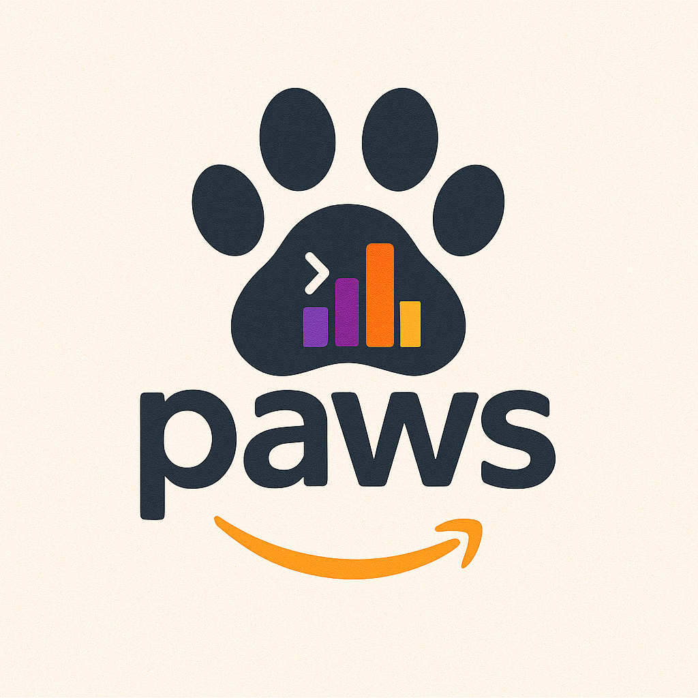

# PAWS - Pulumi login and stack selector plus AWS Profile Switcher in Go

---



paws is a command-line utility that allows you to easily switch between AWS Profiles and if a Pulumi project is detected, it will also allow you to login into the Pulumi state and select the stack you want to work with.

## Table of Contents

- [Installation](#installation)
    - [Homebrew](#homebrew)
    - [Homebrew upgrade](#homebrew-upgrade)
    - [Release Binaries](#release-binaries)
    - [Build from Source](#build-from-source)
- [Usage](#usage)
    - [Pulumi configuration file](#pulumi-configuration-file)
    - [Switching AWS Profiles](#switching-aws-profiles)
- [Development](#development)
    - [Building](#building)
    - [Testing](#testing)
    - [Version Management](#version-management)
- [Contributing](#contributing)
- [License](#license)

## Installation

### Homebrew
If you are using Homebrew, you can install paws with the following command:

```sh
brew tap lzecca78/paws
brew install paws
```

Add this alias to your shell configuration file (e.g., `.bashrc`, `.zshrc`, etc.):

```sh
alias pawsd="source _paws"

```
This will rely on [this](./scripts/_paws) script to set up the environment variables and run the `paws` command.

### Homebrew Upgrade
If you already have paws installed via Homebrew, you can upgrade it with the following command:

```sh
brew upgrade --cask lzecca78/paws/paws
```

> ⚠️ **macOS Gatekeeper Warning**
>
> The Homebrew tap is not signed, so you may need to allow it to run in your macOS security settings. If you encounter an error when trying to run the command, go to `System Preferences > Security & Privacy` and allow the app to run.


### Release Binaries
You can download the latest release binaries from the Releases page on GitHub: [Releases](https://github.com/lzecca78/paws/releases).
Move the binary to a directory in your PATH, such as `/usr/local/bin`, and make it executable:

```sh
chmod +x /path/to/paws
```

⚠️ Remember to copy also the [script](./scripts/_paws) `_paws` in the same directory where you copied the binary, because the binary relies on it to set up the environment variables and run the `paws` command.

### Build from Source

To build from source, you need Go 1.21+ installed:

```sh
git clone https://github.com/lzecca78/paws.git
cd paws
make build
```

This will create a `paws` binary with the version automatically set from git tags.

To install to your `$GOPATH/bin`:

```sh
make install
```

## Usage

### Pulumi configuration file

If you want to use the Pulumi functionality, you need to have a `.pulumi_config.yaml` file in your home directory. This file will be use to bind the aws account id to the bucket name where the Pulumi state is stored. The file should look like this:

```yaml
pulumi_projects:
    "0123456789012": "my-pulumi-bucket"
    "1234567890123": "my-other-pulumi-bucket"
    "234567890123": "my-third-pulumi-bucket"
```

### Switching AWS Profiles

It is possible to shortcut the menu selection by passing the profile name you want to switch to as an argument. The cli doesn't not only switch AWS profile, but also performs lazy aws sso login
For example, to switch to the `work` profile, you can run this in 2 different situations:

#### No Pulumi project detected in the current directory

```
> paws work
Using config file: /Users/myuser/.pulumi_config.yaml
Profile work.
2025-08-05 15:29:08     INFO    Running AWS SSO login...
2025-08-05 15:29:08     INFO    Found valid SSO token in file bcd9c51b7e770dd56a874f26dd93a5e0ffe524d7.json with expiration at 2025-08-05 14:22:50 +0000 UTC
2025-08-05 15:29:08     INFO    SSO token is valid, skipping login.
2025-08-05 15:29:08     INFO    Running SSO login for profile: paws
2025-08-05 15:29:09     INFO    Account: 1234567890123
2025-08-05 15:29:09     INFO    UserID: AO123456679:myuser@hello.com
2025-08-05 15:29:09     INFO    ARN: arn:aws:sts::1234567890123:assumed-role/AWSReservedSSO_MyAccess_1234567890123BEFF/myuser@hello.com
2025-08-05 15:29:09     INFO    AWS SSO login completed.
2025-08-05 15:29:09     WARN    Pulumi.yaml file not found in current directory: /Users/myuser
```

#### Pulumi project detected in the current directory

```
> paws work
Using config file: /Users/myuser/.pulumi_config.yaml
Profile work set.
2025-08-05 15:34:21     INFO    Running AWS SSO login...
2025-08-05 15:34:21     INFO    Found valid SSO token in file bcd9c51b7e770dd56a874f26dd93a5e0ffe524d7.json with expiration at 2025-08-05 14:22:50 +0000 UTC
2025-08-05 15:34:21     INFO    SSO token is valid, skipping login.
2025-08-05 15:34:21     INFO    Running SSO login for profile: work
2025-08-05 15:34:22     INFO    Account: 1234567890389
2025-08-05 15:34:22     INFO    UserID: ARO21345678LCI:myuser@hello.com
2025-08-05 15:34:22     INFO    ARN: arn:aws:sts::1234567890389:assumed-role/AWSReservedSSO_MyAccess_1234567890123BEFF/myuser@hello.com
2025-08-05 15:34:22     INFO    AWS SSO login completed.
2025-08-05 15:34:22     INFO    Pulumi bucket name for account 1234567890389: my-pulumi-state
2025-08-05 15:34:22     INFO    Running pulumi login command: /opt/homebrew/bin/pulumi login s3://my-pulumi-state
2025-08-05 15:34:23     INFO    Running pulumi stack command: /opt/homebrew/bin/pulumi stack ls --json
Search: █
Choose an element?
  ▸ mystack
2025-08-05 15:34:24     INFO    Running pulumi stack command: /opt/homebrew/bin/pulumi stack select mystack
```


To switch between different profiles files using the menu, use the following command:

```bash
paws
```

This command will display a list of available profiles files in your `~/.aws/config` file or from `AWS_CONFIG_FILE`
if you have that set. It expects for you to have named profiles in your AWS config file. Select the one you want to use.
Furthermore, if a `Pulumi.yaml` file is detected in the current directory, it will also log in to the Pulumi state and allow you to select the stack you want to work with.

### Check Version

To check the installed version:

```sh
paws version
# or
paws v
```

## Development

### Building

The project uses a Makefile for common tasks:

```sh
# Build with version from git tags
make build

# Install to $GOPATH/bin
make install

# Clean build artifacts
make clean

# Show all available targets
make help
```

### Testing

```sh
# Run all tests
make test

# Run tests with coverage
make test-cover

# Generate HTML coverage report
make test-cover-html
```

### Version Management

The version is automatically injected at build time using Go's `-ldflags`. The version is determined by:

| Build Method | Version Source | Example |
|--------------|----------------|----------|
| `make build` | `git describe --tags` | `0.3.2-5-gabcdef-dirty` |
| `make install` | `git describe --tags` | `0.3.2-5-gabcdef` |
| `goreleaser` | Git tag | `v1.0.0` |
| `go build` (no flags) | Default | `dev` |

**Version format from `git describe`:**
- `v1.0.0` — Exactly on a tag
- `v1.0.0-5-gabcdef` — 5 commits after tag v1.0.0, at commit abcdef
- `v1.0.0-5-gabcdef-dirty` — Same as above, with uncommitted changes

**Creating a new release:**

```sh
# Tag a new version
git tag v1.0.0
git push --tags

# Release via goreleaser (requires GITHUB_TOKEN)
make release

# Or test release locally
make release-snapshot
```

## Contributing

If you encounter any issues or have suggestions for improvements, please open an issue or create a pull request on [GitHub](https://github.com/lzecca78/paws).

## License

This project is licensed under the GPLv3 - see the [LICENSE](LICENSE) file for details.


Inspired by https://github.com/radiusmethod/awsd
